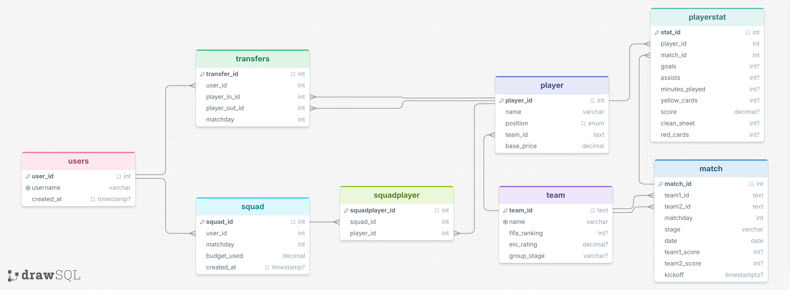

# World Cup Fantasy Football 2026

Single-user fantasy football app for WC 2026. Build an 11-player squad, make transfers between matchdays, and score points based on real match performance.

**Stack:** FastAPI + psycopg2 → Supabase PostgreSQL · Vanilla JS frontend · ESPN hidden API for data

---

## Quickstart

```bash
# 1. Install deps (activate venv first)
source .venv/Scripts/activate
pip install -r requirements.txt

# 2. Set up .env with your Supabase connection string
echo "DATABASE_URL=postgresql://..." > .env

# 3. Seed the database
python tools/seed_foundation.py
python tools/seed_players.py

# 4. Run backend + frontend
uvicorn app.main:app --reload          # → http://127.0.0.1:8000  (API docs at /docs)
cd frontend && python -m http.server 5500   # → http://localhost:5500
```

---

## File Structure

```
fantasy-wc/
├── app/
│   ├── main.py                # FastAPI app, router mounts (/api prefix)
│   ├── database.py            # get_db() dependency — psycopg2 + RealDictCursor
│   ├── schemas.py             # Pydantic request/response models
│   ├── routers/               # Route handlers (one file per domain)
│   │   ├── player.py
│   │   ├── team.py
│   │   ├── match.py
│   │   ├── squad.py
│   │   ├── transfer.py
│   │   ├── playerstat.py
│   │   └── score.py
│   ├── queries/               # Raw SQL (mirrors routers/)
│   │   └── ...
│   └── core/
│       ├── scoring.py         # calculate_score() — isolated, swappable
│       └── validation.py      # Squad/transfer rules, no DB dependency
│
├── frontend/
│   ├── index.html
│   ├── css/                   # tokens.css, main.css, squad.css, scores.css, fixtures.css
│   ├── js/                    # app.js, squad.js, transfers.js, scores.js, fixtures.js, ...
│   ├── assets/                # logo, brand images
│   └── moodboard/             # Design references
│
├── tools/                     # One-off scripts (run outside the app)
│   ├── espn_client.py         # ESPN API wrapper
│   ├── seed_foundation.py     # Seed teams, matches, users
│   ├── seed_players.py        # Seed players from ESPN
│   └── load_stats.py          # Load match stats
│
├── docs/
│   ├── schema.sql             # Database DDL — source of truth for column names
│   ├── API.md                 # Endpoint contracts (note: live paths have /api prefix)
│   ├── SRS.md                 # Requirements + game rules (GR-01…GR-09)
│   ├── logic.md               # Business logic (squad, transfers, scoring)
│   ├── external-data.md       # ESPN data pipeline notes
│   └── DBdesign.jpg           # ↓ see below
│
├── tests/
├── personal/
│   ├── log.md                 # Running dev log — what's built and why
│   └── guide.md               # Original build guide
└── requirements.txt
```

---

## Database Design



Full DDL in [docs/schema.sql](docs/schema.sql).

---

## Key Docs

| File | Purpose |
|---|---|
| [docs/schema.sql](docs/schema.sql) | Column names, constraints — check before writing SQL |
| [docs/API.md](docs/API.md) | Endpoint shapes and error codes |
| [docs/logic.md](docs/logic.md) | Squad creation, transfer, scoring rules |
| [docs/SRS.md](docs/SRS.md) | Full requirements (Vietnamese) |
| `personal/log.md` | Dev log — current state and rationale (gitignored, local only) |
