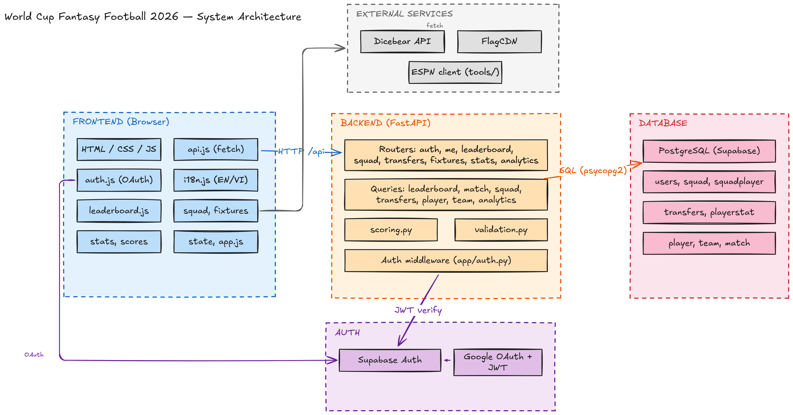

# World Cup Fantasy Football 2026

Build an 11-player World Cup fantasy squad, assign a captain, make matchday transfers, and score points from real match data.

**Stack:** FastAPI + raw SQL (psycopg2) + Supabase PostgreSQL/Auth, vanilla HTML/CSS/JS with bilingual English/Vietnamese support, ESPN API data tooling.

## Quickstart

```bash
source .venv/Scripts/activate
pip install -r requirements.txt
echo "DATABASE_URL=postgresql://..." > .env
uvicorn app.main:app --reload
```

The frontend and API run from the same server on port 8000:

- Frontend: `http://127.0.0.1:8000/`
- API base: `http://127.0.0.1:8000/api`
- API docs: `http://127.0.0.1:8000/docs`

## How It Works

Users sign in with email/password or Google OAuth through Supabase Auth. After signing in, they build a squad of 11 players under a $50M budget, pick a captain (whose score doubles), and make up to 5 transfers per matchday. Points come from real match data loaded from ESPN by an admin.

The app supports English and Vietnamese. If the backend is unreachable, the frontend falls back to mock data for browsing — but auth failures always show the login screen, never fake data.

New users complete their profile by choosing a display name (2–30 characters) before accessing squad, transfer, analytics, or leaderboard features.

## Tests

```bash
pytest tests/ -v
```

Coverage includes validation rules, stat loading, leaderboard behavior, demo seeding, frontend API contracts, frontend security (XSS), rate limiting, display name validation, squad upsert, OAuth username modal, and stat loader.

## Project Structure

```text
fantasy-wc/
|-- app/                        # Backend API server
|   |-- main.py                 # App entry point, CORS, static frontend serving
|   |-- auth.py                 # Supabase token verification
|   |-- permissions.py          # Admin authorization
|   |-- rate_limit.py           # Rate limiting for auth and profile endpoints
|   |-- database.py             # Database connection management
|   |-- schemas.py              # Request validation models
|   |-- routers/                # Route handlers (player, match, playerstat, analytics,
|   |                           #   squad, transfer, team, load_stats, me, leaderboard, auth)
|   |-- queries/                # Database queries (raw SQL via psycopg2)
|   |-- services/               # ESPN stats pipeline
|   `-- core/                   # Scoring and game rule validation
|       |-- scoring.py          # Score calculation (incl. penalty saves)
|       `-- validation.py       # Squad and transfer rules
|
|-- frontend/                   # Web app (HTML/CSS/JS)
|   |-- js/                     # App logic, screens, translations, charts, mock data
|   |                           # Modules: api.js, auth.js, state.js, app.js, squad.js,
|   |                           #   fixtures.js, scores.js, stats.js, leaderboard.js,
|   |                           #   account.js, charts.js, transfers.js, tour.js,
|   |                           #   onboarding.js, howtoscore.js, i18n.js, progress.js, ui.js
|   |-- css/                    # Styles and design tokens (tokens, main, auth, squad,
|   |                           #   fixtures, scores, stats, leaderboard, account, motion)
|   |-- assets/                 # Logo and brand imagery
|   `-- docs/                   # Frontend design specification
|
|-- tools/                      # Data and seeding scripts
|   |-- espn_client.py          # ESPN API wrapper
|   |-- demo_seed.py            # Demo manager seeding
|   |-- run-once/               # One-time setup scripts
|   |-- repeat/                 # Repeatable loaders and verifiers
|   `-- maps/                   # ESPN-to-database ID mappings
|
|-- docs/                       # API contract, requirements, schema, diagrams
|-- tests/                      # Test suite
`-- requirements.txt            # Python dependencies
```

## Architecture



The system has five color-coded zones with labeled data-flow arrows showing how requests and data move between components.

### Zones

| Zone | Color | Role |
|---|---|---|
| **Frontend (Browser)** | Blue | Vanilla HTML/CSS/JS single-page app. No build step, no framework. Modules: `api.js` (fetch wrapper), `auth.js` (Supabase OAuth + session), `i18n.js` (EN/VI translations), `leaderboard.js`, `squad.js` + `fixtures.js`, `stats.js` + `scores.js`, `state.js` + `app.js` (screen routing and lifecycle). |
| **Backend (FastAPI)** | Orange | Python API server on port 8000. Routers handle HTTP endpoints under `/api` (auth, me, leaderboard, squad, transfers, fixtures, stats, analytics). Queries contain raw SQL via psycopg2/RealDictCursor. `scoring.py` calculates points, `validation.py` enforces squad/transfer rules, `auth.py` verifies Supabase JWTs on every request. |
| **Database** | Red | Hosted Supabase PostgreSQL. Core tables: `users`, `squad`, `squadplayer`, `transfers`, `playerstat`, `player`, `team`, `match`. The backend connects via `DATABASE_URL` using psycopg2 — no ORM. |
| **External Services** | Gray | Third-party APIs called directly from the browser. Dicebear generates avatar images, FlagCDN serves country flag SVGs, and the ESPN client (`tools/espn_client.py`) is an admin-only script that fetches match stats and loads them into the database. |
| **Auth** | Purple | Supabase Auth provides email/password and Google OAuth. The frontend uses the Supabase JS SDK to sign in and get a JWT. The backend verifies that JWT on every API request to identify the user. |

### Data Flow

| Arrow | From → To | Protocol | Description |
|---|---|---|---|
| `HTTP /api` | Frontend → Backend | REST over HTTP | All API calls go through `api.js` fetch wrapper to FastAPI routers under `/api`. |
| `SQL (psycopg2)` | Backend → Database | PostgreSQL wire protocol | Backend queries execute raw SQL via psycopg2 with RealDictCursor. Rows returned as dicts. |
| `JWT verify` | Backend → Supabase Auth | Supabase Auth API | Every protected endpoint verifies the user's JWT token with Supabase before processing. |
| `OAuth` | Frontend → Supabase Auth | OAuth 2.0 | `auth.js` uses the Supabase JS SDK for Google OAuth redirect flow and session management. |
| `fetch` | Frontend → Dicebear | HTTPS | Browser fetches avatar images directly from the Dicebear API. No backend involvement. |
| Google OAuth → Supabase | Auth zone internal | OAuth 2.0 | Google OAuth provider feeds into Supabase Auth, which issues JWTs for the app. |

## Documentation

| Document | What it covers |
|---|---|
| [docs/API.md](docs/API.md) | API contract and game rules — what data the system exchanges, how scoring works, and all route definitions. |
| [docs/SRS.md](docs/SRS.md) | Requirements specification — what the product does, architecture, use cases, functional requirements, and design decisions. |
| [docs/schema.sql](docs/schema.sql) | Database schema reference. |
| [docs/ERD.png](docs/ERD.png) | Entity relationship diagram. |
| [docs/DBdesign.jpg](docs/DBdesign.jpg) | Database design visual. |
| [frontend/docs/DESIGN.md](frontend/docs/DESIGN.md) | Frontend design specification — screens, colors, components, and interaction rules. |
