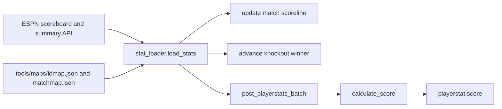

# API And Game Logic Contract

**Version:** 3.3
**Last updated:** 2026-07-04

This document describes what the backend API does, what data it exchanges with the frontend, and the game rules it enforces. It's written for anyone who needs to understand the product's data contract — product managers, designers, and developers.

## Base Path

All API routes live under `/api`. The same server also serves the frontend at `/`.

## Response Format

Successful responses are JSON. Errors return:

```json
{ "detail": "message" }
```

## Auth Model

Users sign in through Supabase Auth (email/password or Google OAuth). The frontend sends the auth token on every protected request. The backend verifies the token, maps it to a local user profile, and scopes all user-specific actions to that identity.

1. User signs in through the frontend.
2. Frontend sends the auth token on protected API calls.
3. Backend verifies the token with Supabase.
4. Backend maps the token to a local user profile.
5. If no local profile exists and the token has a valid display name, the backend creates one automatically.
6. If no local profile exists and no valid display name is available, the backend signals "needs profile" — the frontend blocks the app with a display name modal until the user completes their profile.
7. All user-specific actions use the verified identity — the client never supplies a user ID.

There is no demo-token auth bypass. Demo data is seeded through backend tooling, not through a production shortcut.

Auth failures:

| HTTP | Meaning |
|---|---|
| 401 | Missing, invalid, expired, or unverifiable auth token. |
| 403 | Authenticated but forbidden (inactive user or non-admin calling admin route). |
| 429 | Rate limit exceeded on auth or profile endpoints. |

**Public routes** (no auth required):

- `GET /players` — Browse tournament players
- `GET /players/{id}` — View one player
- `GET /teams` — Browse national teams
- `GET /matches` — Browse fixtures and scorelines
- `GET /matches/{id}` — View one match with player stats
- `GET /playerstats` — Browse raw player stats
- `GET /playerstats/top` — Top performers by category
- `POST /auth/login` — Username + password login

**Protected routes** (auth required):

- `GET /me` — Current user profile
- `POST /complete-profile` — Complete onboarding (choose display name)
- `GET /squad` — View squad for a matchday
- `POST /squad` — Save squad for a matchday
- `GET /transfers` — View transfer history
- `POST /transfer` — Make a transfer
- `GET /analytics/squad-score` — View squad score
- `GET /analytics/composition` — Score breakdown by category
- `GET /analytics/rank-history` — Rank over time
- `GET /leaderboard` — Compare against other managers

**Admin routes** (admin role required):

- `POST /load-stats` — Load match data from ESPN

## Game Rules

| ID | Rule |
|---|---|
| GR-01 | Budget cap is $50M. |
| GR-02 | Squad must contain exactly 11 players. |
| GR-03 | Valid formations are 4-3-3 and 4-4-2. |
| GR-04 | National team limit scales by stage: 3 (Group Stage + R32), 4 (R16), 5 (QF), 6 (SF), 8 (Final). |
| GR-05 | Max 5 transfers per matchday. |
| GR-06 | Player prices are fixed. |
| GR-07 | Transfer window locks 1 hour before first kickoff. |
| GR-08 | Scores count only after player stats are loaded. |
| GR-09 | Captain score is doubled. |
| GR-10 | Squad reads inherit the most recent prior squad when no exact matchday squad exists. |

## Scoring Formula — GR-08, GR-09

Base scores are stored per player per match (GR-08). Captain doubling is applied at read time, not stored (GR-09).

| Event | FWD/MID | DEF/GK |
|---|---:|---:|
| Goal | +5 | +7 (DEF) / +6 (GK) |
| Assist | +3 | +3 |
| Clean sheet | 0 | +4 |
| Saves (GK only) | 0 | +1 each |
| Shots on target (FWD/MID only) | +1 each | 0 |
| 60+ minutes | +2 | +2 |
| 1-59 minutes | +1 | +1 |
| Yellow card | -1 | -1 |
| Red card | -3 | -3 |
| Own goals | -3 | -3 |
| Fouls committed | -0.5 each | -0.5 each |
| Offsides | -0.25 each | -0.25 each |
| Goals conceded (GK/DEF only) | 0 | -0.5 each |

## Stats Pipeline — UC-12, GR-08

Match data is loaded from ESPN's public API by an admin (UC-12). Stats must exist before scores count (GR-08). The pipeline fetches scoreboard data, updates match scorelines, inserts player stats, computes base scores, and advances knockout bracket winners.



If no date is supplied, the loader finds match dates that don't yet have player stats and loads those, expanding each date with the prior calendar day to cover timezone boundaries.

## Routes

### Browse Players — UC-01

**`GET /players`** — Public

Returns tournament-eligible players. Supports filtering by name, position, team, and max price.

Response: array of `{ player_id, name, position, team_id, team_name, base_price }`

**`GET /players/{player_id}`** — Public

Returns one player by ID. Returns 404 if not found.

### Browse Teams — UC-01

**`GET /teams`** — Public

Returns national team metadata: `{ team_id, name, fifa_ranking, elo_rating, group_stage }`

### Browse Matches — UC-08

**`GET /matches`** — Public

Returns fixtures and scorelines. Supports filtering by matchday and stage. Each match includes team names, matchday, stage, date, kickoff, scores, and penalty scores.

**`GET /matches/{match_id}`** — Public

Returns one match plus all player stats for that match. Returns 404 if not found.

### Browse Player Stats — UC-08, UC-10

**`GET /playerstats`** — Public

Returns raw player stat rows, optionally filtered by match or player. Each row includes the computed base score.

**`GET /playerstats/top`** — Public — UC-10

Returns top performers across six categories: top fantasy score, top scorers, top assists, top goal involvements, top clean sheets, and top cards. Supports a `limit` parameter (default 5).

### Login — UC-02

**`POST /auth/login`** — Public

Authenticates by username and password. Resolves the username to an email, then authenticates against Supabase. Returns `{ access_token, refresh_token }`.

Returns 401 for invalid credentials, 503 if the auth service is unreachable.

### Current User Profile — UC-02

**`GET /me`** — Auth required

Returns the authenticated user's profile: `{ user_id, username, display_name, role }`. If the user has no local profile and no valid display name, returns `{ needs_username: true, email, name, avatar_url }` — the frontend blocks the app until the user completes their profile.

### Complete Profile — UC-02

**`POST /complete-profile`** — Auth required

Completes onboarding for authenticated users who don't have a local profile (especially Google OAuth users). Accepts `{ username }` and creates the local profile.

Returns `{ user_id, username, display_name, role }`. Returns 400 for invalid display name, 409 if already completed or display name taken.

### View Squad — UC-05, GR-10

**`GET /squad`** — Auth required

Returns the user's effective squad for a matchday. If no squad exists for the exact matchday, the most recent prior squad is returned (GR-10).

Query: `matchday` (required)

Response: `{ squad_id, matchday, budget_used, budget_remaining, players }`

Returns 404 if no squad exists at or before the requested matchday.

### Save Squad — UC-03, UC-04, GR-01 to GR-04, GR-09

**`POST /squad`** — Auth required

Creates or replaces the user's squad for a matchday. If a squad already exists for that matchday, players are replaced and the captain is updated. Enforces budget cap (GR-01), squad size (GR-02), formation (GR-03), national team limit (GR-04), and captain doubling (GR-09).

Body:

```json
{
  "matchday": 1,
  "player_ids": [1, 2, 3],
  "captain_player_id": 1
}
```

Returns the saved squad object. Returns 400 for validation errors (budget exceeded, wrong squad size, invalid formation, too many players from one nation, missing captain).

### View Transfers — UC-07

**`GET /transfers`** — Auth required

Returns the user's transfer history, optionally filtered by matchday. Each entry includes the player swapped in and out, their names and prices, and the matchday.

### Make Transfer — UC-06, GR-01 to GR-05, GR-07, GR-10

**`POST /transfer`** — Auth required

Swaps one player out and one player in for the current user. Enforces transfer limit (GR-05), transfer window lock (GR-07), and post-transfer squad validity (GR-01 to GR-04, GR-10).

Body:

```json
{
  "player_in_id": 101,
  "player_out_id": 25,
  "matchday": 2
}
```

Returns: `{ transfer_id, player_in_id, player_in_name, player_out_id, player_out_name, matchday, transfers_used, transfers_remaining, budget_remaining }`

Returns 400 if the transfer window is locked, max transfers reached, player not in squad, or the post-transfer squad violates game rules.

### Squad Score — UC-09, GR-08, GR-09

**`GET /analytics/squad-score`** — Auth required

Returns the user's squad score. With a matchday parameter, returns a per-player breakdown for that matchday. Without, returns cumulative scores grouped by matchday.

With matchday:

```json
{
  "matchday": 1,
  "breakdown": [
    { "player_id": 1, "player_name": "Name", "position": "MID", "player_score": 12, "is_captain": true }
  ]
}
```

Without matchday:

```json
{
  "by_matchday": [
    { "matchday": 1, "squad_score": 64 }
  ]
}
```

### Score Composition — UC-10, GR-08, GR-09

**`GET /analytics/composition`** — Auth required

Breaks the user's matchday score into scoring categories: goals, assists, clean sheets, minutes, cards, saves, shots on target, own goals, fouls, offsides, and goals conceded.

Query: `matchday` (required)

Response: `{ matchday, goals_pts, assist_pts, cs_pts, minute_pts, card_pts, saves_pts, sot_pts, own_goal_pts, foul_pts, offside_pts, gc_pts, total }`

### Rank History — UC-09

**`GET /analytics/rank-history`** — Auth required

Returns the user's cumulative rank at each matchday where they have squad scores.

Response: `{ rank_history: [{ matchday, rank, squad_score, total_managers }] }`

### Leaderboard — UC-11, GR-08, GR-09

**`GET /leaderboard`** — Auth required

Returns shared rankings for all active managers and popular player picks for the current or specified matchday.

Query: optional `matchday`

```json
{
  "entries": [
    {
      "rank": 1,
      "user_id": 17,
      "username": "demo_manager",
      "display_name": "Demo Manager",
      "squad_score": 128,
      "delta": null,
      "time_left": 23.5,
      "transfer_count": 2,
      "is_admin": false
    }
  ],
  "my_user_id": 17,
  "available_matchdays": [1, 2, 3],
  "popular_players": [
    {
      "player_id": 42,
      "name": "Haaland",
      "position": "FWD",
      "team_id": "NOR",
      "team_name": "Norway",
      "pick_count": 8,
      "pick_rate": 72.7,
      "captain_count": 3
    }
  ]
}
```

**Admin exclusion:** Admin users are excluded from normal ranking. They receive rank 0 and appear after all normal entries. The frontend filters them from the ranked list and displays them separately with an admin tag.

**Tie-break order:** highest score first, then fewest transfers, then most time remaining, then user ID.

When a matchday is specified, `delta` shows the score difference from the previous matchday. `popular_players` shows the top 10 most-picked players for the resolved matchday, including pick count, pick rate, and captain count.

Empty leaderboards return 200 with empty arrays.

### Load Stats — UC-12, GR-08

**`POST /load-stats`** — Admin required

Loads match scorelines and player stats from ESPN. This is the only endpoint that mutates shared match and scoring data, so it requires admin role.

Body:

```json
{
  "date": "20260613",
  "from_date": null,
  "to_date": null,
  "dry_run": false
}
```

`date` loads one date. `from_date` and `to_date` must be supplied together. If no date is supplied, the service loads missing stat dates discovered from the database.

Returns a summary of what was loaded: dates processed, matches seen/completed/updated, stats inserted/skipped, and any errors.

Returns 400 for invalid dates, 500 for loader failures.

## Security Boundaries

- The frontend may hide controls, but the backend enforces all identity and admin checks.
- All user input in database queries uses parameterized queries.
- User-owned data (squads, transfers, analytics, profile) is always scoped to the verified user.
- Leaderboard is a shared read but still requires authentication.
- Stat loading is admin-only because it changes shared match and scoring state.

## Rate Limiting

The backend includes an in-process rate limiter for auth-sensitive endpoints:

| Endpoint | Limit | Window |
|---|---|---|
| Login | 10 requests | per minute |
| Complete profile | 20 requests | per minute |

Rate-limited responses return 429 Too Many Requests. This is an in-process limiter — production should still add edge/WAF rate limits.

## Known Hardening Items

- Configure CORS if the frontend is deployed on a different origin from the API.
- Add edge/WAF rate limits in front of the app. The in-process limiter is not a durable abuse boundary.
- Supabase RLS is enabled but no app-owned public policies exist. Direct table access should remain denied.
- Revoke broad table privileges before adding any permissive RLS policies.
- Add admin audit logging for stat loading.
- Add idempotency records for stats loading.
- Add tests for auth failure modes and admin authorization.
