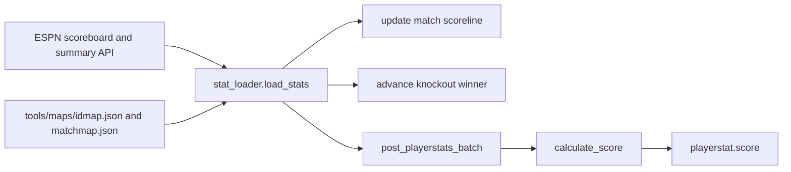

# API And Game Logic Contract

**Version:** 3.0
**Last updated:** 2026-07-03
**Runtime source of truth:** `app/main.py`, `app/routers/*`, `app/queries/*`, `app/core/*`, `app/services/stat_loader.py`

This file is the canonical API contract and business-logic reference. Business rules that used to live in a separate logic note are now merged here.

## Base Path

All API routes are mounted under `/api` by `app/main.py`. Paths below omit that prefix.

The same FastAPI process also serves `frontend/` at `/`.

## Response Format

Successful responses are JSON objects or arrays. Errors use:

```json
{ "detail": "message" }
```

The global exception handler currently returns `detail` and `traceback` on unhandled `500` errors. That is useful during development but should be hardened before production.

## Auth Model

Identity is Supabase Auth. Authorization is enforced in FastAPI.

1. Frontend signs in through Supabase JS.
2. Frontend sends `Authorization: Bearer <access_token>` on protected API calls.
3. `app/auth.py` verifies the JWT using Supabase JWKS, issuer, audience, expiry, and `sub`.
4. `sub` maps to `users.auth_user_id`.
5. If the local user row does not exist, the backend creates it from token metadata/email.
6. Routers use `current_user["user_id"]`; they do not trust a client-supplied `user_id`.

Current demo shortcut:

- `Authorization: Bearer demo-token` maps to auth user id `00000000-0000-0000-0000-000000000000`.
- This is useful for local/demo UX, but it is a production hardening risk.

Auth failures:

| HTTP | Meaning |
|---|---|
| `401` | Missing malformed, invalid, expired, or unverifiable bearer token. |
| `403` | Authenticated but forbidden, such as inactive user or non-admin calling admin route. |

Public routes:

- `GET /players`
- `GET /players/{player_id}`
- `GET /teams`
- `GET /matches`
- `GET /matches/{match_id}`
- `GET /playerstats`
- `GET /playerstats/top`
- `GET /check-username`
- `GET /lookup-username`

Protected user routes:

- `GET /me`
- `GET /squad`
- `POST /squad`
- `GET /transfers`
- `POST /transfer`
- `GET /analytics/squad-score`
- `GET /analytics/composition`
- `GET /analytics/rank-history`
- `GET /leaderboard`

Admin route:

- `POST /load-stats`

## Game Rules

| ID | Rule | Code |
|---|---|---|
| `GR-01` | Budget cap is `50.0` million. | `app/core/validation.py::budget_cap` |
| `GR-02` | Squad must contain exactly 11 players. | `validate_squad_size()` |
| `GR-03` | Valid formations are 4-3-3 and 4-4-2. | `validate_formation()` |
| `GR-04` | Max 3 players from one national team. | `validate_nation_limit()` |
| `GR-05` | Max 5 transfers per matchday. | `max_transfers`, `count_transfers()` |
| `GR-06` | Player prices are fixed in v1. | `player.base_price` |
| `GR-07` | Transfer window locks 1 hour before the first kickoff of that matchday. | `validate_transfer_window()` |
| `GR-08` | Scores count only after `playerstat` rows exist. | analytics/leaderboard joins |
| `GR-09` | Captain score is doubled. | `captain_score_sql()` |
| `GR-10` | Squad reads inherit the latest prior squad when no exact matchday squad exists. | `get_effective_squad()` |

## Scoring Formula

`app/core/scoring.py::calculate_score()` writes the base score to `playerstat.score`.

| Event | FWD/MID | DEF/GK |
|---|---:|---:|
| Goal | +5 | +6 |
| Assist | +3 | +3 |
| Clean sheet | 0 | +4 |
| 60+ minutes | +2 | +2 |
| 1-59 minutes | +1 | +1 |
| Yellow card | -1 | -1 |
| Red card | -3 | -3 |

Captain doubling is not stored in `playerstat.score`. It is applied during squad analytics and leaderboard aggregation.

## Stats Pipeline

Stats are loaded by `app/services/stat_loader.py`, either through the admin API or the repeatable CLI.



If no date is supplied to the API route, the loader asks the database for match dates that do not yet have `playerstat` rows and expands each date with the prior calendar day to cover timezone boundaries.

## Routes

### `GET /players`

**Auth:** Public
**Purpose:** Return tournament-eligible players.
**Query:** `name`, `position`, `team_id`, `max_price`
**Rules:** `GET /players` filters `player.in_tournament = true`.
**Response:** Array of `{ player_id, name, position, team_id, team_name, base_price }`
**Failure modes:** None explicit; database errors return `500`.

### `GET /players/{player_id}`

**Auth:** Public
**Purpose:** Return one player by id.
**Response:** `{ player_id, name, position, team_id, team_name, base_price }`
**Failure modes:** `404` if missing.
**Security boundary:** Read-only catalog data.

### `GET /teams`

**Auth:** Public
**Purpose:** Return team metadata for filters, display labels, and country limits.
**Response:** Array of `{ team_id, name, fifa_ranking, elo_rating, group_stage }`

### `GET /matches`

**Auth:** Public
**Purpose:** Return fixtures and scorelines.
**Query:** `matchday`, `stage`
**Response:** Array including match ids, team ids/names, matchday, stage, date, kickoff, bracket order, regular scores, and penalty scores.
**Security boundary:** Read-only shared tournament state.

### `GET /matches/{match_id}`

**Auth:** Public
**Purpose:** Return one match plus player stats for that match.
**Response:** Match object plus `stats`.
**Failure modes:** `404` if missing.

### `GET /playerstats`

**Auth:** Public
**Purpose:** Return raw player stat rows, optionally filtered.
**Query:** `match_id`, `player_id`
**Response:** Array of stat rows with `score`.
**Rule IDs:** `GR-08`; base scores are already stored.

### `GET /playerstats/top`

**Auth:** Public
**Purpose:** Return leaderboard-style top player stat summaries.
**Query:** `limit` default `5`
**Response:** Object with `top_fantasy_score`, `top_scorers`, `top_assists`, `top_goal_involvements`, `top_clean_sheets`, and `top_cards`.

### `GET /check-username`

**Auth:** Public
**Purpose:** Validate username shape and availability during signup.
**Query:** `username`
**Response:** `{ available, reason }` where `reason` is `invalid`, `taken`, or `ok`.
**Validation:** Regex `^[a-zA-Z0-9_]{3,20}$`.

### `GET /lookup-username`

**Auth:** Public
**Purpose:** Convert username login input into an email for Supabase password sign-in.
**Query:** `username`
**Response:** `{ email }`
**Failure modes:** `404` if username is unknown.
**Security boundary:** This exposes email lookup for known usernames. Rate limiting is a hardening item.

### `GET /me`

**Auth:** Required
**Purpose:** Return the authenticated local user profile.
**Response:** `{ user_id, username, display_name, role }`
**Failure modes:** `401`, `403`.

### `GET /squad`

**Auth:** Required
**Purpose:** Return the current user's effective squad for a matchday.
**Query:** `matchday` required
**Response:** `{ squad_id, matchday, budget_used, budget_remaining, players }`
**Rules:** `GR-10`; the returned squad may be from an earlier matchday.
**Failure modes:** `401`, `403`, `404` if no squad exists at or before the requested matchday.
**Security boundary:** Uses `current_user["user_id"]`; no user id is accepted from the client.

### `POST /squad`

**Auth:** Required
**Purpose:** Create the current user's squad for a matchday.

**Body:**

```json
{
  "matchday": 1,
  "player_ids": [1, 2, 3],
  "captain_player_id": 1
}
```

**Response:** Created squad object.
**Rules:** `GR-01`, `GR-02`, `GR-03`, `GR-04`, `GR-09`.
**Failure modes:** `400` for validation errors, duplicate squad, missing/invalid captain; `401`; `403`; `404` for missing player.
**Security boundary:** User ownership comes only from the verified bearer token.

### `GET /transfers`

**Auth:** Required
**Purpose:** Return current user's transfer history.
**Query:** optional `matchday`
**Response:** Array including transfer ids, player in/out ids/names/prices, and matchday.
**Security boundary:** Query is scoped to `current_user["user_id"]`.

### `POST /transfer`

**Auth:** Required
**Purpose:** Swap one player out and one player in for the current user.

**Body:**

```json
{
  "player_in_id": 101,
  "player_out_id": 25,
  "matchday": 2
}
```

**Response:** `{ transfer_id, player_in_id, player_in_name, player_out_id, player_out_name, matchday, transfers_used, transfers_remaining, budget_remaining }`
**Rules:** `GR-01`, `GR-02`, `GR-03`, `GR-04`, `GR-05`, `GR-07`, `GR-10`.
**Failure modes:** `400` for locked window, max transfers, player not in squad, or invalid post-transfer squad; `401`; `403`; `404` for missing player/squad.
**Security boundary:** Transfers mutate only the authenticated user's squad.

### `GET /analytics/squad-score`

**Auth:** Required
**Purpose:** Return the current user's squad score.

With `matchday`: per-player breakdown for that matchday.

```json
{
  "matchday": 1,
  "breakdown": [
    { "player_id": 1, "player_name": "Name", "position": "MID", "player_score": 12, "is_captain": true }
  ]
}
```

Without `matchday`: cumulative rows grouped by matchday.

```json
{
  "by_matchday": [
    { "matchday": 1, "squad_score": 64 }
  ]
}
```

**Rules:** `GR-08`, `GR-09`; only stats from matches in the squad's matchday count.
**Failure modes:** `401`, `403`, `404` if no squad/stats.

### `GET /analytics/composition`

**Auth:** Required
**Purpose:** Break current user's matchday score into scoring categories.
**Query:** `matchday` required
**Response:** `{ matchday, goals_pts, assist_pts, cs_pts, minute_pts, card_pts, total }`
**Failure modes:** `400` if `matchday` is missing; `401`; `403`.

### `GET /analytics/rank-history`

**Auth:** Required
**Purpose:** Return the current user's cumulative rank at each matchday where they have squad scores.
**Response:** `{ rank_history: [{ matchday, rank, squad_score, total_managers }] }`
**Rules:** Active users only; captain x2; tie break by `user_id ASC`.

### `GET /leaderboard`

**Auth:** Required
**Purpose:** Return shared rankings for active users and popular player picks.
**Query:** optional `matchday`

Response:

```json
{
  "entries": [
    {
      "rank": 1,
      "user_id": 17,
      "username": "demo_manager",
      "display_name": "Demo Manager",
      "squad_score": 128,
      "delta": null
    }
  ],
  "my_user_id": 17,
  "available_matchdays": [1, 2, 3],
  "popular_players": [
    {
      "player_id": 42,
      "name": "Haaland",
      "position": "FWD",
      "team_id": "NOR",
      "team_name": "Norway",
      "pick_count": 8,
      "pick_rate": 72.7,
      "captain_count": 3
    }
  ]
}
```

If `matchday` is supplied, the response also includes `"matchday": N`, and `delta` is current matchday score minus previous matchday score when a previous score exists.

`popular_players` returns the top 10 most-picked players for the resolved matchday. If no `matchday` is supplied, popular players default to the latest matchday that has squads. Each entry includes `pick_count` (number of squads containing the player), `pick_rate` (percentage of active squads), and `captain_count` (how many squads have the player as captain).

**Rules:** Active users only; captain x2; rank is sequential after sorting by `squad_score DESC, user_id ASC`. Popular players sorted by `pick_count DESC, captain_count DESC`.
**Failure modes:** `401`, `403`. Empty leaderboards return `200` with `entries: []` and `popular_players: []`.

### `POST /load-stats`

**Auth:** Required admin
**Purpose:** Load match scorelines and player stats from ESPN.

**Body:**

```json
{
  "date": "20260613",
  "from_date": null,
  "to_date": null,
  "dry_run": false
}
```

`date` loads one date. `from_date` and `to_date` must be supplied together. If no date is supplied, the service loads missing stat dates discovered from the database.

**Response:** `{ dates, matches_seen, matches_completed, matches_updated, inserted, skipped_existing, skipped_unmapped_player, skipped_unmapped_match, errors, errors_detail }`
**Rules:** Mutates shared match/playerstat state, so it requires `role = 'admin'`.
**Failure modes:** `400` invalid dates; `401`; `403`; `500` map or loader failures.

## Security Boundaries

- The frontend may hide controls, but backend dependencies enforce identity and admin checks.
- SQL uses parameterized placeholders for user input in query helpers.
- User-owned rows are scoped by `current_user["user_id"]` in squad, transfer, analytics, and profile routes.
- Leaderboard is a shared authenticated read over active users.
- Stat loading is admin-only because it changes shared match and scoring state.

## Known Hardening Items

- Remove or environment-gate `demo-token` before production.
- Tighten CORS in `app/main.py`; it currently allows all origins.
- Remove tracebacks from production `500` responses.
- Rate limit username lookup and auth-related endpoints.
- Consider Supabase RLS or stored procedures if direct database access expands beyond this backend.
- Add admin audit logging for `/load-stats`.
- Add idempotency/run records for stats loading.
- Add tests for auth/JWKS failure modes and admin authorization.
