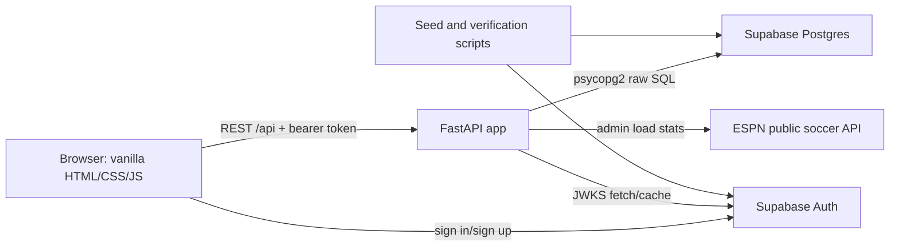
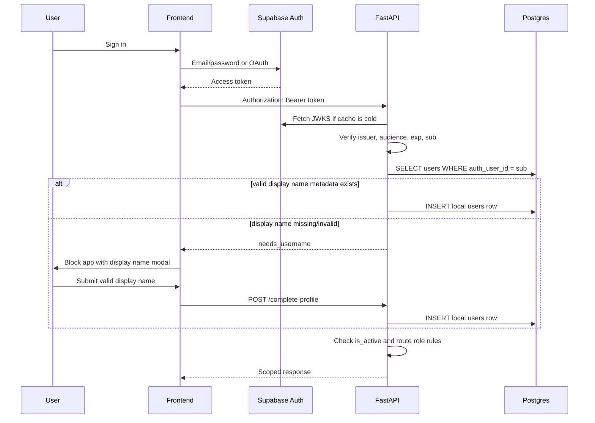
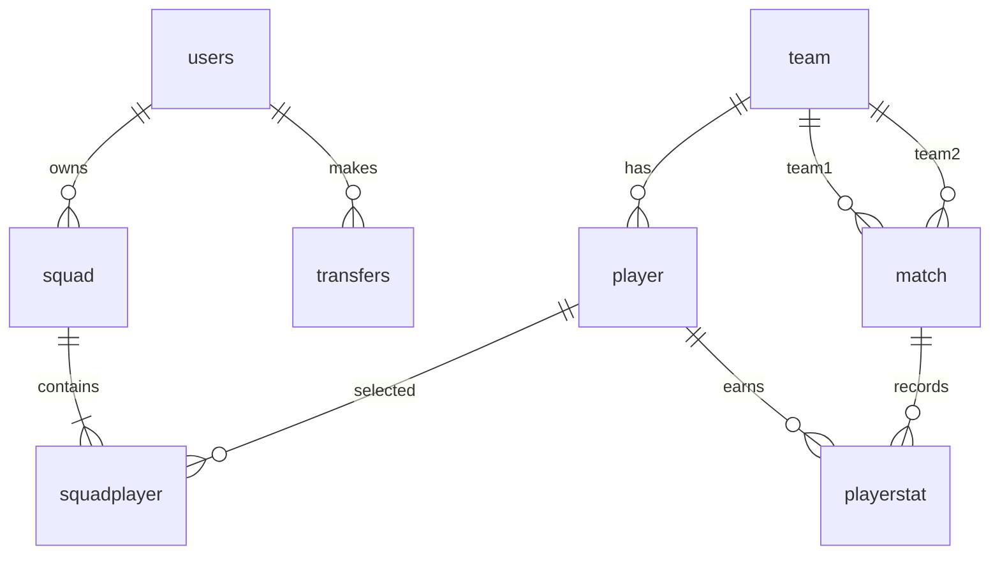
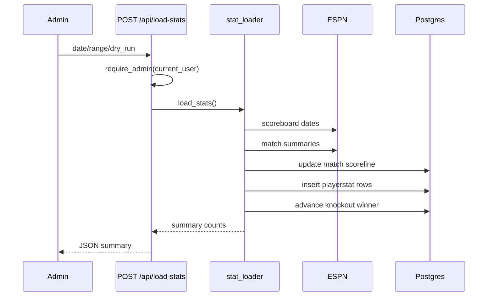

# World Cup Fantasy Football 2026 — Software Requirements Specification

**Version:** 3.4
**Author:** Tan
**Last updated:** 2026-07-09

## 1. Introduction

### 1.1 Product Summary

World Cup Fantasy Football 2026 is a web app where users build an 11-player squad, assign a captain, make limited matchday transfers, and score points from real match data. It's built for the 2026 FIFA World Cup hosted across the USA, Canada, and Mexico.

### 1.2 Scope

- A backend API that handles game rules, scoring, and data storage.
- Supabase Auth for user identity (email/password and Google OAuth).
- A vanilla HTML/CSS/JavaScript frontend served from the same backend.
- ESPN public data for match scorelines and player statistics.
- Seed scripts for teams, players, tournament squads, and demo managers.

### 1.3 Assumptions

- Supabase Auth is the identity provider — the app does not manage passwords directly.
- Each user has a local profile with a display name, role, and active state.
- Display names are 2–30 characters.
- Player stats are loaded after matches complete.
- The captain's score is doubled at read time, not stored doubled.
- Demo users exist for presentation and testing, not as a production security model.

### 1.4 Out Of Scope

- Real-time live scoring.
- Dynamic player prices.
- Vice captain.
- Paid league or private league mechanics.
- Full production observability and edge rate limiting.

## 2. Architecture

### 2.1 Runtime Components

| Component | Responsibility |
|---|---|
| Frontend | App shell, auth UI, squad builder, fixtures, stats, leaderboard, mock fallback. |
| API server | Request handling, auth verification, game rule enforcement, static frontend serving. |
| Auth service | Supabase Auth — credential management, OAuth, JWT issuance. |
| Database | Supabase-hosted PostgreSQL — all app data. |
| Stats pipeline | ESPN-to-database stats ingestion, triggered by admin. |
| Rate limiter | In-process protection for auth and profile endpoints. |
| Seed/verify scripts | One-off and repeatable tools for demo data setup. |

## 3. Auth And Authorization

Authorization decisions:

- User-owned actions (saving squads, making transfers, viewing analytics) are always scoped to the verified user — the client never supplies a user ID.
- Stat loading requires admin role.
- Leaderboard is shared but still requires authentication and filters out inactive users.

## 4. Use Cases

| ID | Actor | Use Case | Description |
|---|---|---|---|
| UC-01 | Visitor/User | View player list | Browse and filter tournament players. |
| UC-02 | User | Sign up/sign in | Authenticate through Supabase Auth. |
| UC-03 | User | Build squad | Pick 11 players under game constraints. |
| UC-04 | User | Assign captain | Choose one squad player for x2 scoring. |
| UC-05 | User | View squad | Read exact or inherited squad for a matchday. |
| UC-06 | User | Make transfer | Swap one player in/out before the lock. |
| UC-07 | User | View transfer history | See prior transfers by matchday. |
| UC-08 | User | View fixtures | Browse matches, stages, dates, scorelines. |
| UC-09 | User | View score | See cumulative and matchday squad score. |
| UC-10 | User | View score composition | Understand goals, assists, clean sheets, minutes, cards. |
| UC-11 | User | View leaderboard | Compare active managers overall or by matchday, and see most-picked players. |
| UC-12 | Admin | Load stats | Update scorelines and player stats from ESPN. |
| UC-13 | Operator | Seed demo users | Create presentation accounts and squads. |
| UC-14 | User | Manage account | View account info (email, role, user ID) and update display name. Avatar selection from preset Dicebear seeds. |

## 5. Functional Requirements

| ID | Requirement | Use Cases |
|---|---|---|
| FR-01 | Users can browse and filter players by name, position, team, and max price. | UC-01 |
| FR-02 | Users can sign up and sign in using email/password or Google OAuth. | UC-02 |
| FR-03 | The backend verifies all authentication tokens before allowing access to protected features. | UC-02 |
| FR-04 | The backend maps each auth token to a local user profile. | UC-02 |
| FR-04A | Authenticated users without a local profile are blocked by a display name modal until they complete their profile. | UC-02 |
| FR-04B | Display names must be 2–30 characters. | UC-02 |
| FR-05 | Squads are created for the authenticated user only — no cross-user squad creation. | UC-03 |
| FR-06 | Squad creation requires exactly one captain. | UC-04 |
| FR-07 | When a matchday has no saved squad, the most recent prior squad is returned. | UC-05 |
| FR-08 | Users can make at most 5 transfers per matchday. | UC-06 |
| FR-09 | Transfers lock 1 hour before the first kickoff of the matchday. | UC-06 |
| FR-10 | Transfer history is tracked per user and per matchday. | UC-07 |
| FR-11 | Fixtures and scorelines are available by matchday and tournament stage. | UC-08 |
| FR-12 | Squad analytics are computed from stored player stats. | UC-09 |
| FR-13 | Captain scoring (x2) is applied at read time, not stored. | UC-09 |
| FR-14 | Score composition is broken down by category (goals, assists, clean sheets, minutes, cards). | UC-10 |
| FR-15 | Leaderboard rankings are available for all active users. | UC-11 |
| FR-16 | Leaderboard supports filtering by matchday. | UC-11 |
| FR-17 | Stat loading is restricted to admin users. | UC-12 |
| FR-18 | Demo users can be seeded deterministically for presentations and testing. | UC-13 |
| FR-19 | Popular player picks are shown per matchday — pick count, pick rate, and captain count. | UC-11 |
| FR-20 | The UI supports English and Vietnamese. All text is translated — no hardcoded English. | All |
| FR-21 | Language preference is saved and restored on return. | All |
| FR-22 | Admin users are excluded from leaderboard ranking. They appear separately with an admin tag, not in the ranked list. | UC-11 |
| FR-23 | Auth endpoints are rate-limited: login (10/min), profile completion (20/min), display name update (10/min) per client. | UC-02 |
| FR-24 | Unsaved squad drafts persist to local storage so accidental refreshes don't lose progress. | UC-03 |
| FR-27 | Users can update their display name from the account screen (PATCH /me). | UC-14 |
| FR-28 | Users can view their account info including email, username, role, and user ID. | UC-14 |
| FR-29 | Per-player stat breakdowns are available per matchday — raw stats, per-stat point breakdown, and total points with captain x2 applied per stat. | UC-09 |
| FR-30 | League comparison shows the user's cumulative score vs the league average at each matchday. Admin scores are excluded from the league average. | UC-09 |
| FR-31 | Penalty saves are scored at +8 points (GK only). | UC-09 |
| FR-32 | Users can choose their avatar from a set of preset Dicebear personas seeds. The selection persists in local storage. | UC-14 |
| FR-25 | Leaderboard ties are broken by: highest score, fewest transfers, most time remaining, then user ID. | UC-11 |
| FR-26 | Each leaderboard entry includes time remaining, transfer count, and admin flag. | UC-11 |

## 6. Game Rules

| ID | Rule |
|---|---|
| GR-01 | Budget cap is $50M. |
| GR-02 | Squad size is exactly 11 players. |
| GR-03 | Valid formations are 4-3-3 and 4-4-2. |
| GR-04 | National team limit scales by stage: 3 (Group Stage + R32), 4 (R16), 5 (QF), 6 (SF), 8 (Final). |
| GR-05 | A user may make at most 5 transfers per matchday. |
| GR-06 | Player prices are fixed. |
| GR-07 | Transfer window locks 1 hour before first kickoff. |
| GR-08 | Scores count only after player stats are loaded. |
| GR-09 | Captain points are doubled during analytics and leaderboard reads. |
| GR-10 | Squad reads inherit the most recent prior squad when no exact matchday squad exists. |

## 7. Data Model

| Entity | What it holds |
|---|---|
| Users | Local profile: display name, role (user/admin), active state, linked Supabase auth identity. |
| Teams | National team metadata (name, FIFA ranking, ELO rating, group). |
| Players | Player catalog: name, position, price, team, tournament eligibility. |
| Matches | Fixture schedule: teams, matchday, stage, kickoff, scoreline, bracket position. |
| Player stats | Per-player per-match raw stats (goals, assists, minutes, cards, clean sheets) and computed base score. |
| Squads | User squad header per matchday: budget used, time remaining. |
| Squad players | Which players are in a squad and who is captain. |
| Transfers | Audit trail of player swap in/out per matchday. |

## 8. Scoring And Stat Loading

Base scores are stored for fast reads. Captain doubling is applied at query time so captain changes and aggregation logic stay transparent.

## 9. Non-Functional Requirements

| ID | Requirement |
|---|---|
| NFR-01 | Protected actions always derive ownership from the verified auth token — never from client-supplied data. |
| NFR-02 | All user input in database queries uses parameterized queries, not string interpolation. |
| NFR-03 | Public catalog endpoints (players, teams, matches) stay fast for the tournament-sized dataset. |
| NFR-04 | Leaderboard and analytics compute from live score data — no stale materialized leaderboard table. |
| NFR-05 | Stat loading is idempotent — running it twice for the same date range produces the same result. |
| NFR-06 | Documentation honestly identifies current security limitations. |
| NFR-07 | Demo seeding is deterministic — it can be verified and rerun with consistent results. |
| NFR-08 | The app degrades gracefully to mock data when the backend is unreachable, but auth failures never trigger mock mode. |
| NFR-09 | All user-facing text is translated — no hardcoded English in the UI. |
| NFR-10 | Dates render using the user's locale format, not hardcoded month names. |
| NFR-11 | All user-supplied text rendered in HTML is escaped to prevent XSS. |
| NFR-12 | User profile pictures use Dicebear personas style with randomized pastel backgrounds. Users can pick from preset avatar seeds on the account screen. |

## 10. Key Design Decisions

| Decision | Why | Tradeoff |
|---|---|---|
| Supabase Auth for identity, backend for authorization | Avoid building password/OAuth security from scratch while keeping game rules in the backend. | Two user concepts must stay synced: Supabase auth user and local profile; OAuth users may need a profile-completion step. |
| Server-scoped user identity | Prevents users from impersonating each other by sending a different user ID. | Every protected route needs auth verification. |
| Admin-only stat loading | Stat loading mutates shared match and scoring state. | Admin account setup is required for demos and operations. |
| Raw SQL queries | Transparent, easy to understand and tune. | Less safety than an ORM; more manual work for mapping and transactions. |
| Stored base scores | Fast reads and simple analytics. | Formula changes require backfill/recompute. |
| Live leaderboard aggregation | No stale leaderboard table to maintain. | Query cost grows with users, squads, and stats. |
| Popular players from squad data | Shows community meta without extra storage. | Pick counts reflect saved squads, not all registered users. |
| Same-origin frontend serving | Simple local development and deployment. | Split-origin deployment requires explicit CORS configuration. |
| Demo users | Strong presentation and testing data. | Demo credentials and seed tooling must stay controlled before production. |
| Mock frontend fallback | App is still inspectable without a backend. | Mock mode must not hide real auth or permission errors. |
| Bilingual support | English and Vietnamese from day one. | Translation keys must be maintained manually; no code generation. |

## 11. Security Model

- Supabase Auth owns credentials and OAuth flows.
- The backend owns profile completion and display name validation before user features load.
- The backend verifies JWTs using Supabase's public key set.
- Local profiles own app role (user/admin) and active state.
- User-owned writes are always scoped server-side.
- Admin-only stat loading protects shared scoring state.
- All database queries use parameters to prevent injection.

Known current limits:

- Auth endpoints have an in-process rate limit (login, profile completion, display name update); production should add an edge/WAF limit.
- Hosted Supabase has RLS enabled with no app-owned public policies; direct table access should remain denied.
- Broad table grants on Supabase should be revoked before any permissive RLS policy is added.
- Admin stat loads are not audit-logged.
- CORS is configured via the `CORS_ALLOW_ORIGINS` environment variable; production should verify allowed origins are restrictive enough.

## 12. Verification

- Run tests: `pytest tests/ -v`
- Check for whitespace errors: `git diff --check`
- Route coverage should be verified against the API router configuration.
- Documentation should not reference removed features or legacy endpoints.
