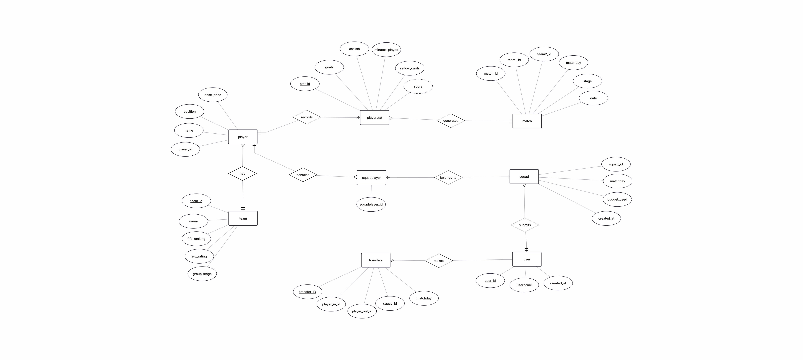

# SRS - World Cup Fantasy Football 2026
**Version:** 2.0  
**Author:** Tân  
**Last Updated:** 2026-06-25

---

## 1. Introduction

### 1.1 Overview
Web app: build đội hình 11 cầu thủ trong budget, tích điểm mỗi matchday dựa thành tích thực tế, thực hiện tối đa 5 transfer giữa các vòng đấu.

### 1.2 System Scope
- Backend: FastAPI + Supabase (PostgreSQL) + psycopg2 (raw SQL)
- Frontend: Vanilla HTML/CSS/JS
- Multi-user với Supabase JWT auth (email/Google sign-in)
- Match stats từ ESPN API hoặc manual entry

### 1.3 Assumptions
- Player data seed từ ESPN roster API + Wikipedia squad lists (canonical cho `in_tournament`)
- Match stats nhập sau mỗi matchday qua ESPN API hoặc manual entry
- v1 scoring: standard fantasy points
- Identity từ verified JWT bearer token, không hardcode `user_id`

### 1.4 Out of Scope
- Real-time live score updates
- Biến động giá cầu thủ
- Captain / vice-captain multiplier
- Scoring multiplier phức tạp hơn (v2)

---

## 2. Use Cases

| ID | Actor | Use Case | Description |
|---|---|---|---|
| UC-01 | User | View player list | Filter theo vị trí, đội, giá |
| UC-02 | User | Build squad | Pick 11 cầu thủ trong budget |
| UC-03 | User | View current squad | Xem squad với giá và vị trí |
| UC-04 | User | Make transfer | Swap một cầu thủ trong transfer window |
| UC-05 | User | View transfer history | Theo matchday |
| UC-06 | User | View fixtures | Lịch thi đấu vòng hiện tại và sắp tới |
| UC-07 | User | View matchday score | Điểm squad theo từng matchday |
| UC-08 | User | View score breakdown | Đóng góp điểm từng cầu thủ mỗi vòng |
| UC-09 | User | View points chart | Biểu đồ điểm tích lũy |
| UC-10 | User | View budget | Budget còn lại và số transfer còn lại |
| UC-11 | System | Calculate score | Tự động tính khi insert stats |
| UC-12 | System | Lock transfers | Khóa transfer khi matchday kickoff |
| UC-13 | System | Validate squad | Formation, budget, team limit trước khi lưu |

---

## 3. Functional Requirements

### 3.1 Squad Management

| ID | Yêu cầu | UC |
|---|---|---|
| FR-01 | Filter players theo vị trí, đội, giá | UC-01 |
| FR-02 | Pick 11 cầu thủ để build squad | UC-02 |
| FR-03 | Formation: 4-3-3 hoặc 4-4-2 (1 GK, 4 DEF, 3/4 MID, 3/2 FWD) | UC-02, UC-13 |
| FR-04 | Tổng giá ≤ $50M | UC-02, UC-13 |
| FR-05 | Max 3 cầu thủ cùng đội tuyển | UC-02, UC-13 |
| FR-06 | Xem squad hiện tại với giá và vị trí | UC-03 |

### 3.2 Transfers

| ID | Yêu cầu | UC |
|---|---|---|
| FR-07 | Max 5 transfer mỗi matchday window | UC-04 |
| FR-08 | Giá bán cộng lại vào budget | UC-04 |
| FR-09 | Giá mua trừ khỏi budget | UC-04 |
| FR-10 | Transfer khóa khi matchday kickoff | UC-12 |
| FR-11 | Transfer chưa dùng không tích lũy sang vòng sau | UC-04 |
| FR-12 | Hiển thị transfer còn lại và budget trước khi confirm | UC-10 |

### 3.3 Scoring

| ID | Yêu cầu | UC |
|---|---|---|
| FR-13 | Tính điểm từng cầu thủ từ stats thực tế sau mỗi matchday | UC-11 |
| FR-14 | Bảng điểm v1 (xem §8 API.md) | UC-11 |
| FR-15 | Điểm matchday = tổng điểm 11 cầu thủ trong squad | UC-07 |
| FR-16 | Điểm tích lũy = tổng tất cả matchday | UC-07 |
| FR-17 | Scoring algorithm swappable không ảnh hưởng endpoints | UC-11 |

### 3.4 Stats & Reporting

| ID | Yêu cầu | UC |
|---|---|---|
| FR-18 | Xem tổng điểm và breakdown theo từng matchday | UC-07, UC-08 |
| FR-19 | Xem biểu đồ điểm tích lũy | UC-09 |
| FR-20 | Xem đóng góp điểm từng cầu thủ mỗi vòng | UC-08 |
| FR-21 | Xem budget còn lại | UC-10 |

### 3.5 Fixtures

| ID | Yêu cầu | UC |
|---|---|---|
| FR-22 | Xem lịch thi đấu vòng hiện tại và sắp tới | UC-06 |
| FR-23 | Hiển thị: hai đội, ngày giờ, group stage label | UC-06 |

### 3.6 Data Pipeline

| ID | Yêu cầu |
|---|---|
| FR-24 | Player data (tên, vị trí, đội, giá) seed vào DB |
| FR-25 | Match data (hai đội, matchday, stage) seed vào DB |
| FR-26 | Match stats nhập qua manual entry, ESPN script, hoặc bulk endpoint |
| FR-27 | Raw stats lưu riêng biệt với computed score |

---

## 4. Game Rules

| ID | Quy tắc |
|---|---|
| GR-01 | Budget: $50M |
| GR-02 | Squad: đúng 11 cầu thủ |
| GR-03 | Formation: 4-3-3 hoặc 4-4-2 |
| GR-04 | Max 3 cầu thủ cùng đội tuyển |
| GR-05 | Max 5 transfer mỗi matchday |
| GR-06 | Giá cố định trong v1 — giá bán = giá mua |
| GR-07 | Transfer khóa khi matchday kickoff |
| GR-08 | Điểm chỉ tính sau khi stats có trong DB |
| GR-09 | Scoring formula versioned và swappable (v1 = standard, v2 = TBD) |

---

## 5. Data Design

### 5.1 ER Diagram



### 5.2 Database Schema


### 5.3 Entities

| Entity | Key Attributes |
|---|---|
| **users** | user_id, username, auth_user_id, display_name, role, is_active, created_at |
| **team** | team_id, name, fifa_ranking, elo_rating, group_stage |
| **player** | player_id, espn_id, name, position, team_id, base_price, in_tournament |
| **match** | match_id, team1_id, team2_id, matchday, stage, date, kickoff, team1_score, team2_score |
| **playerstat** | stat_id, player_id, match_id, goals, assists, minutes_played, yellow_cards, red_cards, clean_sheet, score (derived) |
| **squad** | squad_id, user_id, matchday, budget_used, created_at |
| **squadplayer** | squadplayer_id, squad_id, player_id |
| **transfer** | transfer_id, user_id, player_in_id, player_out_id, matchday |

### 5.4 Key Relationships

- `users` 1:N `squad` — một squad per matchday
- `squad` 1:N `squadplayer` — đúng 11 per squad
- `player` 1:N `squadplayer` — player có thể xuất hiện trong nhiều squad
- `player` 1:N `playerstat` — một stat row per match
- `match` 1:N `playerstat` — một match generates nhiều stats
- `users` 1:N `transfer` — một user có nhiều transfer records
- `team` 1:N `player` — một team có nhiều players

### 5.5 Key Constraints

- `UNIQUE (user_id, matchday)` on `squad`
- `UNIQUE (player_id, match_id)` on `playerstat`
- `UNIQUE (squad_id, player_id)` on `squadplayer`
- `UNIQUE (espn_id)` on `player`
- `CHECK (position IN ('GK', 'DEF', 'MID', 'FWD'))` on `player`
- `in_tournament boolean DEFAULT false` on `player` — chỉ rows `true` xuất hiện trong player pool. Nguồn: Wikipedia 2026 FIFA World Cup squads.

---

## 6. Tech Stack

### 6.1 Stack

| Layer | Technology |
|---|---|
| Backend | FastAPI (Python) |
| Database | Supabase (hosted PostgreSQL) |
| DB Driver | psycopg2 (raw SQL) |
| Frontend | Vanilla HTML / CSS / JS |

### 6.2 Python Libraries

| Library | Purpose |
|---|---|
| `fastapi` | Web framework |
| `uvicorn` | ASGI server |
| `psycopg2-binary` | PostgreSQL driver |
| `python-dotenv` | Load `.env` credentials |
| `pydantic` | Request/response validation (v2) |
| `PyJWT` | Verify Supabase JWT tokens |
| `cryptography` | JWT key decoding (RS256 + ES256) |
| `httpx` | HTTP client cho JWKS fetch |
| `beautifulsoup4` | Parse Wikipedia squad HTML |

### 6.3 Project Structure

```
fantasy-wc/
├── app/
│   ├── main.py         # FastAPI entry point, static frontend mount
│   ├── auth.py         # Supabase JWT verification (RS256 + ES256)
│   ├── permissions.py  # require_admin helper
│   ├── database.py     # get_db() dependency, psycopg2 + RealDictCursor
│   ├── schemas.py      # Pydantic request models
│   ├── routers/        # API route handlers
│   ├── queries/        # Raw SQL query functions
│   ├── services/       # Backend services (stat loading)
│   └── core/
│       ├── scoring.py     # calculate_score()
│       └── validation.py  # Squad and transfer rules
├── frontend/           # HTML/CSS/JS frontend
├── tools/
│   ├── espn_client.py  # ESPN API wrapper
│   ├── run-once/       # Pre-tournament setup scripts
│   ├── repeat/         # Repeatable during tournament
│   └── maps/           # ESPN ID -> DB ID maps
├── tests/
├── .env                # Supabase credentials (never commit)
├── requirements.txt
└── docs/
```

---

## 7. Glossary

| Term | Definition |
|---|---|
| Matchday | Một vòng đấu World Cup trong cùng period |
| Squad | Đội hình 11 cầu thủ cho một matchday |
| Transfer | Swap một cầu thủ trong transfer window |
| Transfer window | Khoảng thời gian giữa hai matchday khi được phép thay đổi squad |
| Budget | Tiền ảo mua cầu thủ ($50M default) |
| Score | Điểm tích lũy của cầu thủ trong một match, tính bởi scoring engine |
| Scoring engine | Module tính điểm từ raw stats |
| Seed | Nhập dữ liệu ban đầu vào database |
| Stage | Giai đoạn giải đấu: Group Stage, R32, R16, QF, SF, Final |
| Raw SQL | SQL trực tiếp trong Python, không ORM |

