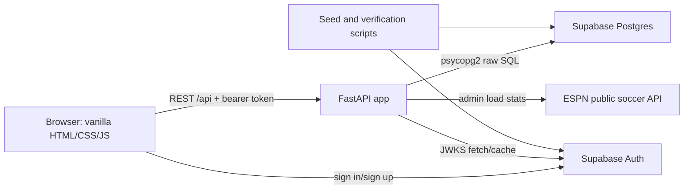
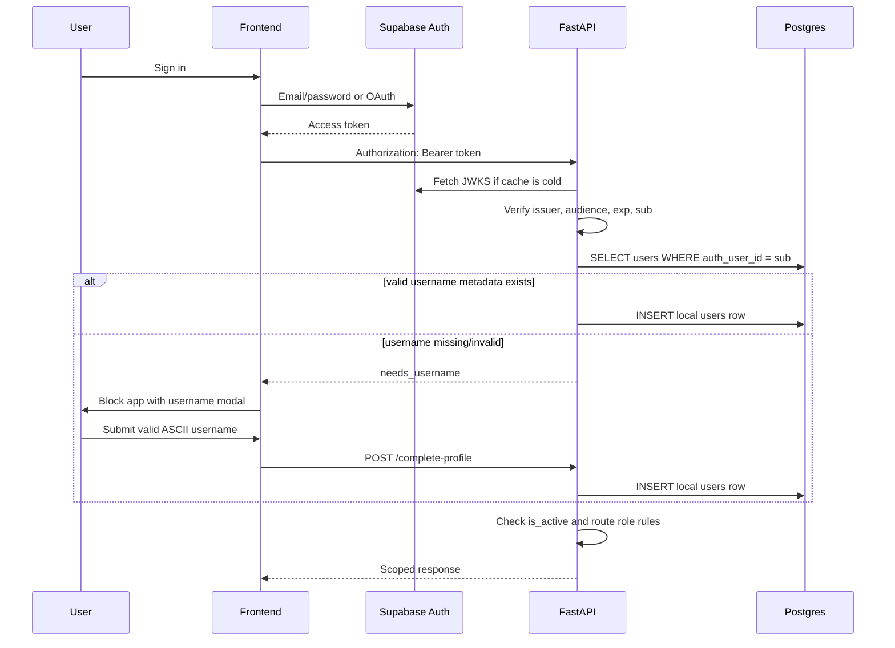
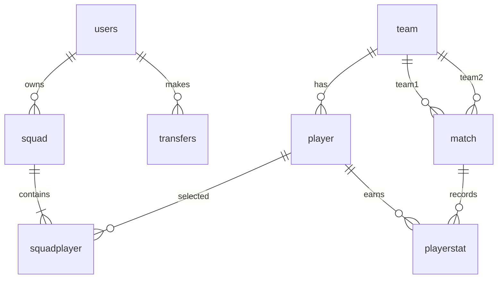
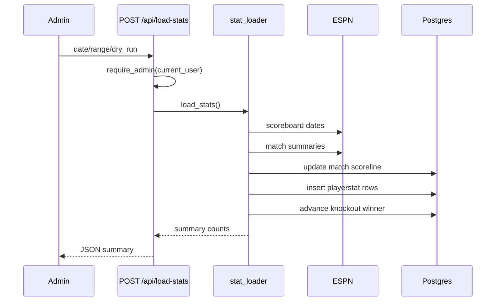

# SRS - World Cup Fantasy Football 2026

**Version:** 3.2
**Author:** Tan
**Last updated:** 2026-07-04

## 1. Introduction

### 1.1 Product Summary

World Cup Fantasy Football 2026 is a web app where authenticated users build an 11-player squad, assign a captain, make limited matchday transfers, and score points from real match data.

### 1.2 Scope

- Backend: FastAPI, raw SQL through psycopg2, Supabase-hosted PostgreSQL.
- Identity: Supabase Auth JWTs.
- Authorization: FastAPI dependencies and database queries scoped by local `users.user_id`.
- Frontend: Vanilla HTML, CSS, and JavaScript served by the same FastAPI process.
- Data: ESPN score/stat ingestion plus seed scripts for teams, players, tournament squads, and demo managers.

### 1.3 Assumptions

- Supabase Auth is the identity provider.
- Local `users` rows store app-specific username, display name, role, active state, and `auth_user_id`.
- Usernames are app profile data: trimmed, 3-20 chars, ASCII letters/numbers/underscore/spaces only; Vietnamese diacritics and punctuation are invalid.
- Raw player stats are loaded after matches complete.
- `playerstat.score` stores the base score; captain x2 is applied during reads.
- Demo users are presentation/testing data, not a production security model.

### 1.4 Out Of Scope

- Real-time live scoring.
- Dynamic player prices.
- Vice captain.
- Paid league/private league mechanics.
- Full production observability and rate limiting.

## 2. Architecture

### 2.1 Runtime Components

| Component | Responsibility |
|---|---|
| `frontend/` | App shell, auth UI, squad builder, fixtures, stats, leaderboard, mock fallback. |
| `app/main.py` | FastAPI assembly, CORS middleware, `/api` routers, static frontend mount. |
| `app/auth.py` | Bearer parsing, Supabase JWT verification, JWKS cache, local user lookup/create. |
| `app/permissions.py` | Admin gate. |
| `app/database.py` | Threaded psycopg2 connection pool and transaction dependency. |
| `app/routers/*` | HTTP request handling and auth dependency boundaries. |
| `app/queries/*` | Raw SQL reads/writes. |
| `app/core/*` | Scoring and game-rule validation. |
| `app/services/stat_loader.py` | ESPN-to-database stats pipeline. |
| `tools/*` | One-off and repeatable seed/load/verify scripts. |

## 3. Auth And Authorization

Authorization decisions:

- User-owned routes use `current_user["user_id"]`.
- Client-supplied `user_id` is not accepted for squad, transfer, analytics, or profile routes.
- `/api/load-stats` requires `role = 'admin'`.
- Leaderboard is shared but still authenticated and filters inactive users.

## 4. Use Cases

| ID | Actor | Use Case | Description |
|---|---|---|---|
| `UC-01` | Visitor/User | View player list | Browse and filter tournament players. |
| `UC-02` | User | Sign up/sign in | Authenticate through Supabase Auth. |
| `UC-03` | User | Build squad | Pick 11 players under game constraints. |
| `UC-04` | User | Assign captain | Choose one squad player for x2 scoring. |
| `UC-05` | User | View squad | Read exact or inherited squad for a matchday. |
| `UC-06` | User | Make transfer | Swap one player in/out before the lock. |
| `UC-07` | User | View transfer history | See prior transfers by matchday. |
| `UC-08` | User | View fixtures | Browse matches, stages, dates, scorelines. |
| `UC-09` | User | View score | See cumulative and matchday squad score. |
| `UC-10` | User | View score composition | Understand goals, assists, clean sheets, minutes, cards. |
| `UC-11` | User | View leaderboard | Compare active users overall or by matchday, and see most-picked players per matchday. |
| `UC-12` | Admin | Load stats | Update scorelines and player stats from ESPN. |
| `UC-13` | Operator | Seed demo users | Create presentation accounts and squads. |

## 5. Functional Requirements

| ID | Requirement | Use Cases |
|---|---|---|
| `FR-01` | The app shall list players filtered by name, position, team, and max price. | `UC-01` |
| `FR-02` | The app shall support Supabase email/password and OAuth auth through the frontend. | `UC-02` |
| `FR-03` | The backend shall verify bearer JWTs before protected route access. | `UC-02` |
| `FR-04` | The backend shall map JWT `sub` to local `users.auth_user_id`. | `UC-02` |
| `FR-04A` | The app shall block authenticated users without a valid local username behind the username modal until `POST /api/complete-profile` succeeds. | `UC-02` |
| `FR-04B` | The app shall validate usernames as trimmed 3-20 character ASCII letters, numbers, underscores, and spaces; Vietnamese diacritics and punctuation are invalid. | `UC-02` |
| `FR-05` | The app shall create squads for the authenticated user only. | `UC-03` |
| `FR-06` | The app shall require exactly one captain on squad creation. | `UC-04` |
| `FR-07` | The app shall return the latest prior squad when a requested matchday has no exact squad. | `UC-05` |
| `FR-08` | The app shall let users make at most 5 transfers per matchday. | `UC-06` |
| `FR-09` | The app shall lock transfers 1 hour before first kickoff of the matchday. | `UC-06` |
| `FR-10` | The app shall maintain transfer history by user and matchday. | `UC-07` |
| `FR-11` | The app shall expose fixtures and scorelines by matchday/stage. | `UC-08` |
| `FR-12` | The app shall compute squad analytics from stored player stats. | `UC-09` |
| `FR-13` | The app shall apply captain x2 at score-read time. | `UC-09` |
| `FR-14` | The app shall expose score composition by scoring category. | `UC-10` |
| `FR-15` | The app shall expose leaderboard rankings for active users. | `UC-11` |
| `FR-16` | The app shall expose available leaderboard matchdays. | `UC-11` |
| `FR-17` | The app shall restrict stat loading to admin users. | `UC-12` |
| `FR-18` | The app shall support deterministic demo-user seeding and verification. | `UC-13` |
| `FR-19` | The app shall expose popular player picks per matchday, including pick count, pick rate, and captain count. | `UC-11` |
| `FR-20` | The frontend shall support bilingual UI (English and Vietnamese) via a `t()` translation function with `data-i18n` attributes for static text and `t()` calls for dynamic text. | All |
| `FR-21` | The frontend shall persist language preference in `localStorage` and reload on toggle. | All |

## 6. Game Rules

| ID | Rule |
|---|---|
| `GR-01` | Budget cap is $50M. |
| `GR-02` | Squad size is exactly 11 players. |
| `GR-03` | Valid formations are 4-3-3 and 4-4-2. |
| `GR-04` | National team limit scales by tournament stage: 3 (Group Stage + R32), 4 (R16), 5 (QF), 6 (SF), 8 (Final). |
| `GR-05` | A user may make at most 5 transfers per matchday. |
| `GR-06` | Player prices are fixed in v1. |
| `GR-07` | Transfer window locks 1 hour before first kickoff. |
| `GR-08` | Scores count after stats exist in `playerstat`. |
| `GR-09` | Captain points are doubled during analytics and leaderboard reads. |
| `GR-10` | Squad reads inherit the most recent prior squad. |

## 7. Data Model

Existing diagrams:

- `docs/ERD.png`
- `docs/DBdesign.jpg`

| Entity        | Owns                                                                              |
| ---------------| -----------------------------------------------------------------------------------|
| `users`       | Local app identity, username, display name, role, active state, Supabase auth id. |
| `team`        | National team metadata.                                                           |
| `player`      | Player catalog, ESPN id, position, price, tournament eligibility.                 |
| `match`       | Fixture schedule, stage, kickoff, scoreline, bracket order.                       |
| `playerstat`  | Per-player per-match raw stats and stored base score.                             |
| `squad`       | User squad header per matchday.                                                   |
| `squadplayer` | Squad membership and captain flag.                                                |
| `transfers`   | User transfer audit rows.                                                         |

## 8. Scoring And Stat Loading

Base score is stored for fast reads. Captain multipliers are applied in SQL at read time so captain changes and score aggregation logic remain visible.

## 9. Non-Functional Requirements

| ID | Requirement |
|---|---|
| `NFR-01` | Protected routes must derive ownership from verified backend auth context. |
| `NFR-02` | SQL that includes user input must use parameters, not string interpolation. |
| `NFR-03` | Public catalog endpoints should remain fast for the tournament-sized dataset. |
| `NFR-04` | Leaderboard and analytics should aggregate from normalized score tables without a separate materialized leaderboard in v1. |
| `NFR-05` | Stat loading must be idempotent for repeated runs through `ON CONFLICT DO NOTHING`. |
| `NFR-06` | Docs and API contracts must identify current security limitations plainly. |
| `NFR-07` | Demo seeding must be deterministic enough to verify and rerun. |
| `NFR-08` | The app should remain usable with frontend mock fallback when the backend is unreachable, but auth failures must not trigger mock fallback. |
| `NFR-09` | All user-facing strings shall use `t()` calls or `data-i18n` attributes — no hardcoded English in JS or HTML. |
| `NFR-10` | Dates shall render via `toLocaleDateString()` using the active locale from `date.locale` i18n key, not hardcoded month arrays. |

## 10. Key Design Decisions And Tradeoffs

| Decision | Why | Tradeoff |
|---|---|---|
| Supabase Auth for identity, FastAPI for authorization | Avoid building password/OAuth security while keeping app rules in Python. | Two user concepts must stay synced: Supabase auth user and local `users` row; OAuth users may need a username-completion step. |
| Backend-scoped `current_user["user_id"]` | Prevents horizontal privilege escalation through client-provided ids. | More backend dependencies on every protected route. |
| Admin-only `/api/load-stats` | It mutates shared match and scoring state. | Admin account setup is required for demos/operations. |
| Raw SQL | Transparent queries, easy to teach and tune. | Less ORM safety/productivity; more manual mapping and transaction discipline. |
| Stored `playerstat.score` | Fast reads and simple analytics. | Formula changes require backfill/recompute. |
| Leaderboard aggregate query | No stale stored leaderboard table. | Query cost grows with users/squads/stats. |
| Popular players from squadplayer | Shows community meta without extra storage. | Pick counts reflect squads saved, not all users. |
| Same-origin frontend serving | Simple local/deploy model. | Split-origin deployment requires `CORS_ALLOW_ORIGINS` to be configured explicitly. |
| Demo users | Strong presentation/testing data. | Demo credentials and seed tooling must stay controlled before production. |
| Mock frontend fallback | App is still inspectable without backend. | Mock mode must not hide real auth/permission errors. |
| Bilingual i18n via `t()` + `data-i18n` | No framework dependency; works with vanilla JS. | Translation keys must be maintained in `i18n.js`; no codegen. |

## 11. Security Model

- Supabase Auth owns credentials and OAuth.
- FastAPI owns app profile completion and username validation before user-scoped features load.
- FastAPI verifies JWTs with Supabase JWKS.
- Local `users` owns app role and active-state authorization.
- User-owned writes are scoped server-side.
- Admin-only stat loading protects shared state.
- SQL parameters reduce injection risk.

Known current limits:

- Username availability, username login, and profile-completion endpoints have an in-process backend rate limit; production should still add an edge/WAF limit.
- Hosted Supabase has RLS enabled with no app-owned public policies; direct table access should remain denied unless policies are deliberately designed.
- Hosted Supabase currently has broad `anon`/`authenticated` table grants. Those grants should be revoked before any permissive RLS policy is added.
- Admin stat loads are not audit-logged.

## 12. Verification Targets

- `pytest tests/ -v`
- `.\.venv\Scripts\python.exe -m pytest tests\ -q`
- `git diff --check`
- Route coverage should be checked against `app/main.py` and `app/routers/*`.
- Stale docs should not point readers at removed logic notes, legacy score endpoints, or removed stat-write endpoints.
